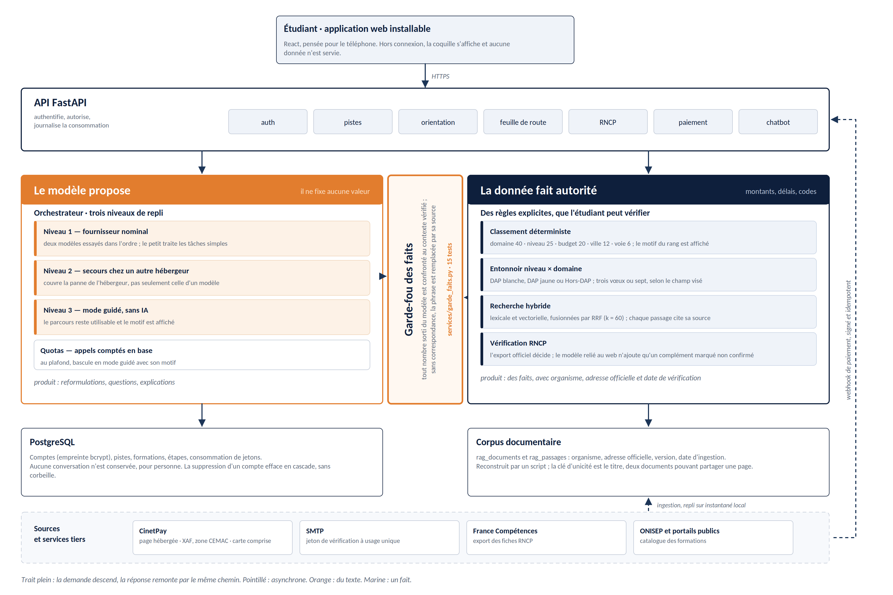

# One Moov — Architecture et parcours bout-en-bout



*Source de la figure : `docs/architecture.svg`, régénérable par
`python scratchpad/figures/architecture.py`. Trait plein : la demande
descend, la réponse remonte par le même chemin. Pointillé : asynchrone.*

## Le principe directeur

Un modèle de langage produit du texte plausible, pas du texte vrai. Toute
l'architecture tient dans la conséquence que nous en avons tirée :

> **Le modèle propose, la donnée fait autorité.**

Le modèle reformule, explique et pose des questions. Aucun montant, aucun
délai, aucun code de certification ne sort de lui. Ces valeurs viennent de
la base, avec leur organisme, leur adresse officielle et leur date de
vérification.

Ce principe n'est pas une promesse de prompt, il est tenu par du code. Trois
mécanismes le rendent vérifiable :

| Mécanisme | Fichier | Ce qu'il empêche |
|---|---|---|
| Le garde-fou des faits | `app/services/garde_faits.py` | Qu'un nombre sorti du modèle atteigne l'étudiant sans correspondre au contexte vérifié |
| Le classement déterministe | `app/services/orientation_engine.py` | Qu'une formation soit recommandée sans motif affichable |
| L'ordre de la vérification RNCP | `app/routers/rncp.py` | Qu'un code de certification soit établi par une IA |

Le garde-fou compare chaque nombre produit par le modèle aux valeurs
présentes dans le contexte vérifié. Sans correspondance, il ne corrige pas
la phrase : il la remplace par un renvoi à la source. Quinze tests tiennent
cette règle.

## La résilience

L'orchestrateur (`app/services/llm.py`) descend trois niveaux :

1. **Le fournisseur nominal**, deux modèles essayés dans l'ordre, le petit
   pour les tâches simples.
2. **Un secours chez un hébergeur différent.** Une cascade de deux modèles
   chez le même hébergeur ne couvre que la panne d'un modèle. Elle ne couvre
   pas la panne de l'hébergeur, qui emporte les deux d'un coup.
3. **Le mode guidé, sans IA.** Le parcours reste utilisable, et le motif de
   la bascule est affiché à l'étudiant.

Les quotas (`app/services/quotas.py`) comptent les appels en base plutôt
qu'en mémoire : une instance redémarrée ou dupliquée ne remet pas le
compteur à zéro. Au plafond, le service bascule de lui-même au niveau 3.

---

## Inscription et première piste

### 1. Inscription (prénom, e-mail, WhatsApp)

`POST /api/auth/register`
Le client envoie prénom + e-mail + mot de passe. L'API stocke le prénom,
l'e-mail en clair (pour la connexion) et l'empreinte bcrypt du mot de
passe. Rien d'autre.

### 2. Vérification e-mail / SMS (code à usage unique)

`POST /api/auth/verify` (avec le lien reçu par e-mail).
Un jeton à usage unique est envoyé. Sans SMTP configuré, il apparaît dans
les journaux du serveur (mode démo) ; sinon un vrai courrier part.

**Le numéro WhatsApp** est capturé dès l'inscription pour servir aux
rappels d'échéances (voir étape 13).

---

## Orientation gratuite

### 3. Créer une piste (pays cible) et lancer l'orientation

`POST /api/pistes {"pays": "Cameroun"}`

### 4. RAG — passages officiels pertinents

`app/services/rag.py:rechercher()`
Chaque appel du conseiller déclenche une recherche hybride :

* **Lexicale** : intersection de tokens (BM25-approximatif, sans dépendance
  à `pg_trgm`).
* **Dense** : cosinus sur les embeddings, si un fournisseur est
  configuré (Mistral, OpenAI, local).
* **Fusion** : Reciprocal Rank Fusion (`k = 60`).

Les passages proviennent de trois sources : le corpus procédural
d'amorçage (`app/donnees/procedures.json`), le catalogue de formations
enrichi, et les fiches RNCP synchronisées. Chaque passage porte son
`organisme`, son `url_officielle`, sa `version`.

### 5. Scoring déterministe (budget · niveau · RNCP)

`app/services/orientation_engine.py:top_formations()`
Ce sont des règles explicables, pas un modèle. Pondération :

* domaine 40 pts
* niveau visé 25 pts
* budget 20 pts
* ville souhaitée 12 pts
* voie (public / privé) 6 pts

Les formations viennent de la table `formations` (jamais du LLM).
`explication` cite les raisons du score, ce qui est affiché à l'étudiant.

Le classement porte aussi une `correspondance` : `domaine`, `proche`,
`sans_domaine` ou `hors_domaine`. Elle passe avant le score dans le tri, de
sorte qu'une formation étrangère au champ visé ne peut pas remonter en tête
à la faveur du budget ou de la ville. Quand aucun critère du profil ne
correspond, l'étiquette le dit, au lieu de l'ancien libellé « formation du
domaine » qui affirmait le contraire.

`domaines_couverts()` expose ce que le catalogue contient réellement. Si le
champ visé n'y figure pas, un bandeau le signale à l'étudiant plutôt que de
lui servir une liste plausible et fausse.

### 5 bis. Entonnoir niveau × domaine

`app/services/roadmap_engine.py:procedure_pour()` et
`app/data/procedures/france.py`.

La procédure applicable ne dépend pas que du niveau d'entrée. Deux champs
échappent à la règle « la DAP, c'est la première année » :

* **Santé** (médecine, pharmacie, chirurgie dentaire, maïeutique,
  masso-kinésithérapie, PASS) → **DAP blanche**, trois vœux.
* **Architecture**, à tout niveau d'entrée, master compris → **DAP jaune**,
  trois vœux.
* Tout le reste, à partir de la L2 → **Hors-DAP**, sept vœux.

L'enjeu est concret : un étudiant en médecine à qui l'on annonce Hors-DAP
dépose sept vœux en décembre et perd son année sans avoir rien fait de
visiblement faux. Le domaine est appliqué **après** le niveau, ce qui permet
aux deux cas particuliers de corriger la règle générale. Le nombre d'étapes,
lui, ne change jamais : l'entonnoir adapte le contenu du parcours, il n'en
retire aucune marche.

### 6. Mise en forme du texte du rapport — LLM Groq

`app/routers/orientation.py:_synthese()`
Le LLM reçoit le **profil déjà validé** et produit uniquement la synthèse
(2-3 phrases), les atouts, les points d'attention, la prochaine étape. Il
ne choisit ni ne classe aucune école, aucune ville, aucun montant.

### 7. Conversation empathique → rapport d'orientation (gratuit)

`POST /api/orientation/chat` puis `POST /api/orientation/rapport`
La conversation vise 7-8 échanges couvrant : parcours, motivation,
domaine, projet France, projet pro, niveau, budget/financement, ville,
long terme. Elle se termine par le marqueur `[[PRET]]` que le front lit
pour proposer le bouton « Générer mon rapport ».

Depuis la fusion, le prompt système du conseiller reçoit **3 passages
RAG pertinents** en plus (extrait du dernier message étudiant → recherche
→ injection dans le prompt). Le conseiller reste maître du fil, mais ses
conseils sont ancrés dans du réel.

---

## Passage à la feuille de route — payant

### 8. Choix voie + méthode (mobile money)

`POST /api/roadmap/voie {"voie": "public" | "prive"}`
En voie privée, un formulaire supplémentaire ouvre la vérification RNCP
(exigence 4 du cahier des charges) :

`POST /api/rncp/verify {"intitule", "etablissement", "code_rncp"}`

L'ordre compte, et il a été inversé par rapport à la première version :

1. **L'export officiel de France Compétences**, synchronisé localement
   (`app/services/rncp_client.py`), est interrogé en premier. Quand il rend
   un statut fermé — `actif`, `absent`, `inactif`, `expire` — la réponse
   s'arrête là. C'est la base qui décide.
2. **Le modèle relié au web** (`app/services/rncp_web.py`) n'intervient que
   sur les cas que l'export ne tranche pas. Son apport est alors marqué
   `statut_confiance: "non confirme"` et ne peut pas déconseiller une
   formation à lui seul.

La version précédente faisait l'inverse : le modèle répondait par défaut et
la base servait de repli. Un code de certification sortait donc d'une IA
dans le cas nominal, ce que le mémoire affirmait pourtant éviter.

### 9. Créer une session de paiement hébergée

`POST /api/paiement/create` → renvoie une URL CinetPay. L'étudiant paie
sur la page sécurisée du fournisseur ; aucune donnée bancaire ne
transite par One Moov.

### 10. Paiement mobile money (Orange Money · MTN) ou carte

Hors One Moov. L'étudiant valide sur la page hébergée.

Deux points qui ne se voient pas en bac à sable :

* **La devise est le XAF**, pas le XOF (`app/services/cinetpay.py:DEVISE`).
  Le Cameroun et le Congo-Brazzaville sont en zone CEMAC ; le XOF est le
  franc CFA d'Afrique de l'Ouest. Les deux partagent la même parité fixe
  avec l'euro, si bien qu'un montant converti reste juste et que l'erreur
  ne se révèle qu'au moment du refus par l'opérateur.
* **La carte bancaire est déjà couverte.** `channels: "ALL"` inclut
  `CREDIT_CARD` : le parent ou le cousin qui paie depuis la diaspora n'a
  besoin d'aucun développement supplémentaire.

### 11. Webhook de confirmation (signé, idempotent) → accès ouvert

CinetPay → `POST /api/paiement/webhook`. La signature est vérifiée, le
statut est mis à jour, la piste passe `paid=True`. Idempotent :
plusieurs livraisons du même webhook produisent le même effet.

---

## Feuille de route et suivi

### 12. Feuille de route — vue arbre, échéances, prochaine action

`POST /api/roadmap/generate` puis `GET /api/pistes/{id}`.
L'arbre est construit par niveaux de dépendance
(`app/services/roadmap_engine.py`). Chaque étape a une échéance conseillée,
un statut (`verrouille` / `ouvert` / `fait`) et une urgence
(`retard` / `bientot` / `avenir` / `fait`). Les étapes critiques sont
marquées ; les valider demande une confirmation supplémentaire.

Le **chatbot** (`POST /api/chatbot`) est débloqué en même temps que la
feuille de route. Il reçoit :

* le contexte de l'étape en cours ;
* **les passages RAG pertinents pour la question posée**, filtrés par
  phase (candidature / entretien / visa / logement / arrivée) ;
* les faits vérifiés associés (montants, délais).

Le LLM doit citer `[1]` `[2]` ; l'API renvoie les vraies sources dans le
champ `sources` de la réponse.

### 13. Rappels WhatsApp J-3 des étapes critiques

Tâche de fond planifiée : 3 jours avant chaque étape critique non
faite, un message part vers le numéro capturé à l'étape 1.

---

## En continu — tâches de fond

### 14. ETL des sources officielles

`scripts/enrichir_formations_web.py` ingère 4 sources en cascade,
chacune avec un instantané local de repli :

* **ONISEP Idéo** (public) — annuaire des formations
* **Mon Master** (public) — référentiel des mentions master
* **Parcoursup** (public) — fiches formations post-bac
* **Écoles privées** (partenariats) — snapshot local

`scripts/ingerer_rag.py` reconstitue ensuite la base vectorielle à
partir de la table `formations`, du corpus procédural et des fiches
RNCP synchronisées.

**La clé d'unicité est le titre du document, pas son adresse.** Deux
documents peuvent légitimement renvoyer à la même page officielle, et c'est
le cas depuis que les liens morts ont été corrigés. Tant que l'idempotence
reposait sur l'URL, le second document était ignoré en silence pendant que
le journal annonçait une ingestion réussie. Une section entière du corpus
manquait ainsi à la recherche. Le script avertit désormais quand deux titres
identiques se présentent.

### 15. Mesure de la recherche

`scripts/evaluer_rag.py` rejoue un jeu de questions annotées contre le
corpus et rend le rappel avec son intervalle de confiance de Wilson, la
petite taille d'échantillon rendant la proportion seule trompeuse.

```bash
python -m scripts.evaluer_rag --reference   # plein texte naïf, repère bas
python -m scripts.evaluer_rag              # construction de requête
python -m scripts.evaluer_rag --phase      # avec détection de phase
```

`scripts/ingerer_rncp.py` synchronise l'export officiel de France
Compétences (`FRANCE_COMPETENCES_BASE` dans `config.py`).

---

## Le fil rouge de la fiabilité

```
Front sans logique sensible
    → API qui vérifie tout
        → recherche + classement qui fournissent les faits
            → modèle qui met en forme
                → garde-fou qui confronte le texte aux faits
                    → sources officielles synchronisées.
```

À aucun moment un fait ne sort du modèle seul. C'est cette discipline qui
distingue One Moov d'un assistant conversationnel : chaque chiffre, chaque
date, chaque code RNCP porte sa source et sa date de vérification.

Ce que l'architecture ne fait toujours pas, et qu'il vaut mieux lire ici que
découvrir en production :

* Une question sur deux ne trouve pas encore le bon passage dans le corpus.
  Le chiffre est mesuré, il est de 53 % avec un intervalle de 36 à 70, et la
  commande qui le reproduit est donnée plus haut.
* Le mode hors connexion sert la coquille de l'application, pas les données.
  Le service worker refuse délibérément de mettre `/api` en cache : une
  échéance périmée servie de mémoire ferait plus de dégâts qu'un écran qui
  annonce l'absence de réseau.
* Le catalogue de formations provient d'un jeu d'amorçage tant que
  `OPEN_DATA_FORMATIONS_URL` n'est pas renseignée. Il ne contient ni école
  d'architecture ni première année de santé, ce qui rend l'entonnoir de
  l'étape 5 bis juste dans sa procédure et vide dans ses propositions.
